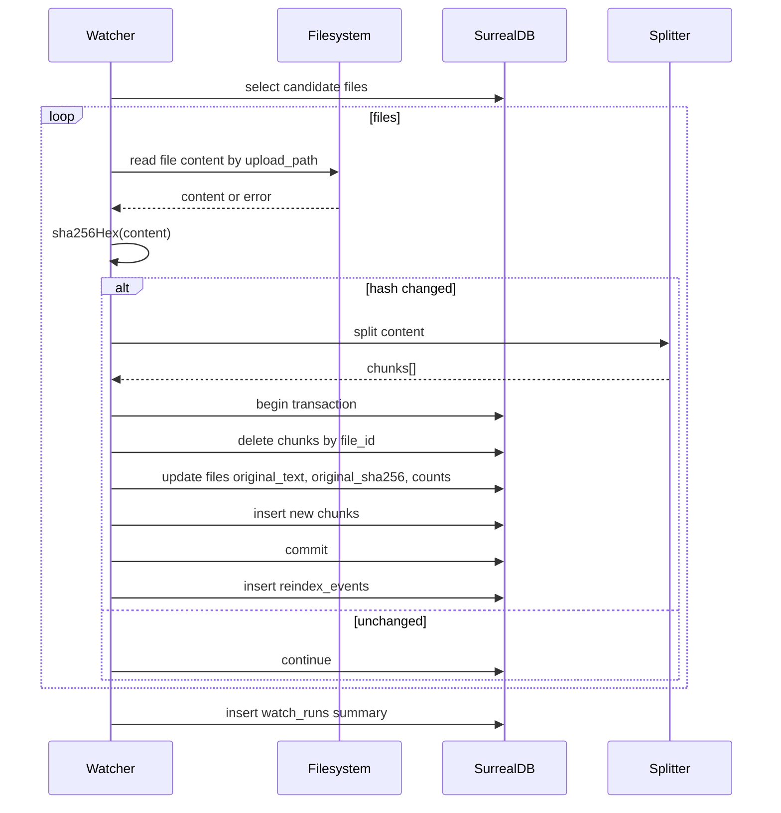

# Server-side file watch and reindex plan

Summary

- Watch files represented in DB records to detect content changes by hashing source content and comparing to files.original_sha256. When changed, update files.original_text, files.original_sha256, and regenerate chunks transactionally.

Current state

- Upload endpoint [POST()](src/routes/api/files/upload/+server.ts:79) computes [sha256Hex()](src/routes/api/files/upload/+server.ts:68) and persists [original_text, original_sha256, chunk_count](src/routes/api/files/upload/+server.ts:206).
- Chunks are created in loop via [db.create()](src/routes/api/files/upload/+server.ts:231) with fields [file_id, content, chunk_index, start_char, end_char, token_count](src/routes/api/files/upload/+server.ts:216).
- DB infra is provided by [getDb()](src/lib/server/infra/db.ts:100).
- Debug listing endpoint [GET()](src/routes/api/debug/files/+server.ts:5) retrieves files and chunks for inspection.
- files.upload_path is stored but no on-disk persistence is implemented in code today.

Requirements

- Poll the source content for all files in DB at a configurable interval.
- Compute SHA-256 and compare with files.original_sha256.
- If different, read full content, split to chunks using the same parameters as upload, update files and chunks atomically.
- Emit audit trail per watch run with counts and timings.
- Provide manual reindex endpoints for a single file and for a batch.
- Be resilient and idempotent, with backoff on errors.

Source of truth

- Primary mode A: local filesystem path from files.upload_path. Read on-disk file and hash contents.
- Fallback mode B: database driven change. If files.original_text changes by external process, compare files.original_sha256 to hash(original_text) and re-chunk.
- Mode selection via config SERVER_CONFIG.watch.mode in [.env.example](.env.example) and [SERVER_CONFIG](src/lib/config.ts:1).

Architecture

- Use a background watcher started from [hooks.server.ts](src/hooks.server.ts:1) on server startup. It schedules a periodic job with setInterval style loop.
- Also expose admin endpoints to trigger on-demand reindex.

Data model changes

- New table watch_runs: id, started_at, finished_at, mode, scanned_count, changed_count, error_count, notes.
- New table reindex_events: id, file_id, run_id optional, old_sha256, new_sha256, status, message, duration_ms, created_at.
- Optional: index on files.name and files.upload_path for quick lookup.

Algorithm

- Fetch candidate files:
  - If mode A: select files where upload_path is not null.
  - If mode B: select files.
- For each file:
  - Determine source text:
    - Mode A: read file from disk at serverRoot + upload_path. If missing, mark error.
    - Mode B: use files.original_text.
  - Compute sha = sha256Hex(text).
  - If sha === files.original_sha256: continue.
  - Else reprocess:
    - Split using [RecursiveCharacterTextSplitter](src/routes/api/files/upload/+server.ts:98) with identical parameters.
    - Start a DB transaction. Pseudo:
      - Update files.original_text, files.original_sha256, original_length, chunk_count, updated_at, status processing->uploaded.
      - Delete existing chunks for file_id.
      - Insert new chunk rows in order preserving chunk_index.
    - Record a reindex_events row with old and new sha.
- Aggregate numbers into a watch_runs row.

Endpoints

- POST /api/files/reindex/:id
  - Body: optional override content or mode.
  - Logic: run the reprocess algorithm on one file id.
- POST /api/files/watch/run
  - Triggers a single scan cycle immediately and returns watch_runs summary.
- GET /api/debug/files remains for inspection.

Scheduler wiring

- In [hooks.server.ts](src/hooks.server.ts:1) add a singleton scheduler that:
  - Reads interval from SERVER_CONFIG.watch.intervalMs with sane default e.g. 60000.
  - Uses a mutex to prevent overlapping runs.
  - Logs start and finish to watch_runs.

Observability

- Console logs with prefixed tags.
- Persisted watch_runs and reindex_events.
- Expose counts on debug page via extension of [GET()](src/routes/api/debug/files/+server.ts:58).

Backfill

- For existing records without original_sha256 but with original_text:
  - Compute hash and merge it.
- For records with upload_path pointing to readable file but no original_text:
  - Read file, set original_text and derived fields, generate chunks.

Edge cases

- File missing on disk: mark error, do not delete existing chunks.
- File unreadable: mark error with message.
- Very large files: enforce max size or stream read with limit.
- Splitter parameters drift: centralize constants to avoid mismatch.
- Concurrent reindex: protect with per-file lock keyed by id.

Acceptance criteria

- When a file on disk changes, within interval it is detected and re-chunked. files.original_sha256 and chunks reflect new content.
- Manual reindex endpoint works for a given file id.
- watch_runs and reindex_events capture metrics and errors.
- No overlapping runs and no partial chunk sets left behind.

Implementation steps mapped to files

1. Config

- Add watch config shape to [SERVER_CONFIG](src/lib/config.ts:1): mode, intervalMs, rootPath.
- Update [.env.example](.env.example:1) with WATCH_MODE, WATCH_INTERVAL_MS, WATCH_ROOT_PATH.

2. Types

- Add DB record types for watch_runs and reindex_events near [file-upload-types.ts](src/lib/ui/file-upload-types.ts:1) or a new server types module.

3. Shared utilities

- Extract [sha256Hex()](src/routes/api/files/upload/+server.ts:68) into a shared server util module [hash.ts](src/lib/server/hash.ts:1).
- Extract chunking constants and splitter builder used by [POST()](src/routes/api/files/upload/+server.ts:98) into [chunking.ts](src/lib/server/chunking.ts:1).

4. Background watcher

- Create [watcher.ts](src/lib/server/watch/watcher.ts:1) exporting startWatcher() and stopWatcher().
- Implement polling loop, file iteration, hashing, compare, and reprocess call.
- Use per-run context to aggregate metrics and write watch_runs at start and finish.

5. DB operations

- Add helpers in [db.ts](src/lib/server/infra/db.ts:100) or new module [files-repo.ts](src/lib/server/infra/files-repo.ts:1):
  - getAllFilesWithPaths()
  - getFileById(id)
  - updateFileOriginal(fileId, fields)
  - deleteChunksByFile(fileId)
  - insertChunks(fileId, chunks, runId)
  - createWatchRun()
  - finishWatchRun()
  - createReindexEvent()
- Consider using db.query() for bulk delete of chunks: DELETE FROM chunks WHERE file_id = $fileId

6. Reprocess function

- Add [reprocessFile()](src/lib/server/watch/reprocess.ts:1): given a file record and source text, performs transactional update and re-chunk.
- Ensure splitter matches upload parameters from [chunking.ts](src/lib/server/chunking.ts:1).

7. Startup hook

- Wire watcher in [hooks.server.ts](src/hooks.server.ts:1): startWatcher() on init, stop on server shutdown if applicable.

8. API endpoints

- Create [POST()](src/routes/api/files/reindex/[id]/+server.ts:1) to reindex a single file.
- Create [POST()](src/routes/api/files/watch/run/+server.ts:1) to run one scan.

9. Debug UI

- Extend [GET()](src/routes/api/debug/files/+server.ts:58) to include latest watch_runs summary.
- Optionally add /debug/watch page.

10. Migrations and backfill script

- Create [backfill()](src/routes/api/admin/backfill/+server.ts:1) endpoint to compute missing hashes and chunks.

11. Concurrency control

- Implement an in-memory Map<string, boolean> as lock in [watcher.ts](src/lib/server/watch/watcher.ts:1) to avoid double reindex per file.

Mermaid sequence



Open questions to settle during implementation

- Exact transaction semantics supported by SurrealDB client in this runtime. If full transactions unavailable, emulate with careful ordering and a temporary status like reindexing and a final sweep to remove stale chunks for any reindexing files with duplicate sets.
- Large dataset paging for candidate selection.
- Maximum concurrency for hashing and re-chunking to balance load.

File map to create

- src/lib/server/hash.ts
- src/lib/server/chunking.ts
- src/lib/server/watch/watcher.ts
- src/lib/server/watch/reprocess.ts
- src/lib/server/infra/files-repo.ts
- src/routes/api/files/reindex/[id]/+server.ts
- src/routes/api/files/watch/run/+server.ts
- src/routes/api/admin/backfill/+server.ts
- docs/plans/app/0003-file-watch-and-reindex.md

Rollout plan

- Phase 1: Implement manual reindex endpoint and shared utilities.
- Phase 2: Implement watcher and small interval in dev only.
- Phase 3: Add backfill endpoint and debug surfacing.
- Phase 4: Harden concurrency and error handling, enable in prod.

Testing strategy

- Unit test sha256 and chunking builders.
- Integration tests that mutate a test file on disk and assert reindex updates via [GET()](src/routes/api/debug/files/+server.ts:58).
- Endpoint tests for reindex single and watch run using fixtures.

Performance notes

- Use streaming reads for very large files or enforce size caps.
- Batch insert chunks where possible to reduce DB round-trips.

Security considerations

- Restrict watch to a configured root path.
- Protect admin endpoints with auth if exposed beyond local.

Acceptance checklist

- Hash changes trigger chunk updates automatically within interval.
- Manual reindex works and is idempotent.
- Backfill computes missing hashes and chunks for existing data.
- Observability tables reflect accurate counts.

References

- Upload implementation [POST()](src/routes/api/files/upload/+server.ts:79)
- DB client [getDb()](src/lib/server/infra/db.ts:100)
- Debug listing [GET()](src/routes/api/debug/files/+server.ts:5)

---

API validation via Context7 (SurrealDB JS SDK and LangChain text splitters)

Validated libraries and key APIs against latest docs using Context7 to ensure our plan matches current interfaces and capabilities.

SurrealDB JavaScript SDK and @surrealdb/node

- Engines and embedded mode

  - The Node engine plugin is configured with surrealdbNodeEngines() and passed to the Surreal constructor, matching our DB infra in [db.ts](src/lib/server/infra/db.ts:121).
  - Supported embedded protocols include mem://, surrealkv://, and surrealkv+versioned:// per official examples.

- Connection and authentication

  - Connecting with URL plus namespace/database options is supported; the SDK also allows auth at connect time.
  - Our logic to skip db.signin when using embedded engines and authenticate only on network engines aligns with SDK guidance that embedded engines don’t require signin. See usage pattern comparable to our [getDb()](src/lib/server/infra/db.ts:100) flow.

- Query and CRUD methods

  - db.query executes SurrealQL; db.select selects tables/records; db.merge is a convenience for partial updates and aligns with patterns in [upload API](src/routes/api/files/upload/+server.ts:235).
  - PreparedQuery and surql tagged template are available for safer parameterization if we later refactor complex multi-statement operations.

- Live queries option (alternative watcher strategy)

  - The SDK supports table-level change subscriptions via live/subscribeLive/kill. As a follow-up enhancement, we can consider a DB-driven reindexer that listens to UPDATE events on files or chunks and queues reprocessing, instead of or in addition to the filesystem poller. This is compatible with our plan’s optional “DB-driven change” mode.

- Transactions
  - Context7 docs do not expose a dedicated JavaScript transaction API beyond multi-statement db.query; our plan’s note to emulate atomicity with careful ordering and temporary statuses remains valid. We will keep the defensive approach: mark file status reindexing, delete+insert chunks, finalize file, then clear status, and ensure idempotency by per-file locks.

LangChain JavaScript text splitters

- Package and constructor

  - The code already imports from @langchain/textsplitters in [upload route](src/routes/api/files/upload/+server.ts:7), which matches latest packages.
  - RecursiveCharacterTextSplitter constructor accepts chunkSize, chunkOverlap, separators array, consistent with our usage in [splitter init](src/routes/api/files/upload/+server.ts:98).

- Methods and defaults
  - splitText(text) returns string[]; createDocuments/splitDocuments operate on Document instances; our use of splitText in [upload route](src/routes/api/files/upload/+server.ts:203) is correct for producing string chunks.
  - Defaults for separators are [\n\n, \n, , ] if none provided; we explicitly set a stable list in the plan to ensure deterministic chunking between upload and reindex.
  - TokenTextSplitter remains available if we later switch to token-based constraints; current plan keeps character-based for parity.

Plan adjustments informed by latest APIs

- Confirmed: Our extraction of hashing logic into a shared server util and chunker builder will mirror the exact options currently used by the upload route to guarantee consistent chunk outputs.
- Confirmed: Using embedded engines (surrealkv://) without signin is supported and reflected in our connection flow; leaving signin to network scenarios is correct.
- Enhancement option: Consider a follow-on milestone to add a DB live-query watcher that listens for UPDATE on files.original_text or status transitions, as a low-latency alternative or complement to polling, leveraging SDK live/subscribeLive.

No changes to the core implementation steps are required based on the latest APIs. The existing plan is compatible with current SurrealDB JS SDK and @langchain/textsplitters.

---

Junior implementer guide — concrete steps, code, and do/don’t

Use this section to implement the watcher and reindex features with copy-pasteable code. Follow in order. Where a file doesn’t exist yet, you’ll create it.

Quick start checklist

- Create shared utils: [sha256Hex()](src/lib/server/hash.ts:1), [buildTextSplitter()](src/lib/server/chunking.ts:1)
- Create DB repo helpers: [FilesRepo](src/lib/server/infra/files-repo.ts:1)
- Create reindex logic: [reprocessFile()](src/lib/server/watch/reprocess.ts:1)
- Create watcher: [startWatcher()](src/lib/server/watch/watcher.ts:1)
- Wire startup: add to [handle](src/hooks.server.ts:1)
- Add endpoints:
  - [POST](src/routes/api/files/reindex/[id]/+server.ts:1) to reindex one file
  - [POST](src/routes/api/files/watch/run/+server.ts:1) to force one scan
  - Optional backfill: [POST](src/routes/api/admin/backfill/+server.ts:1)

1. Shared hashing util
   Create: src/lib/server/hash.ts

Purpose: Stable SHA-256 to match upload code.

Code:

```ts
// src/lib/server/hash.ts
export async function sha256Hex(input: string): Promise<string> {
  const data = new TextEncoder().encode(input);
  const hashBuffer = await crypto.subtle.digest("SHA-256", data);
  const bytes = new Uint8Array(hashBuffer);
  let hex = "";
  for (let i = 0; i < bytes.length; i++)
    hex += bytes[i].toString(16).padStart(2, "0");
  return hex;
}
```

Use: Replace any direct hashing with [sha256Hex()](src/lib/server/hash.ts:1).

2. Shared chunking builder
   Create: src/lib/server/chunking.ts

Keep chunk params identical to upload route to ensure deterministic updates.

Code:

```ts
// src/lib/server/chunking.ts
import { RecursiveCharacterTextSplitter } from "@langchain/textsplitters";

export const CHUNK_SIZE = 1000;
export const CHUNK_OVERLAP = 200;
export const CHUNK_SEPARATORS = [
  "\n\n",
  "\n",
  " ",
  ".",
  ",",
  "\u200b",
  "\uff0c",
  "\u3001",
  "\uff0e",
  "\u3002",
  "",
] as const;

export function buildTextSplitter() {
  return new RecursiveCharacterTextSplitter({
    chunkSize: CHUNK_SIZE,
    chunkOverlap: CHUNK_OVERLAP,
    separators: [...CHUNK_SEPARATORS],
  });
}
```

Use: Both upload and reindex should use [buildTextSplitter()](src/lib/server/chunking.ts:1).

3. DB repo helpers
   Create: src/lib/server/infra/files-repo.ts

Purpose: Centralize SurrealDB queries for files/chunks/watch logs.

Code:

```ts
// src/lib/server/infra/files-repo.ts
import { getDb } from "./db.js";
import type { RecordId } from "surrealdb";

export type FileId = RecordId<"files">;
export type RunId = RecordId<"watch_runs">;

export interface FileRow {
  id: FileId;
  name: string;
  original_name: string;
  original_text?: string;
  original_length?: number;
  original_sha256?: string;
  upload_path?: string;
  status?: string;
  chunk_count?: number;
  updated_at?: string;
}

export interface ChunkRow {
  id: RecordId<"chunks">;
  file_id: FileId;
  content: string;
  chunk_index: number;
  start_char: number;
  end_char: number;
  token_count: number;
  run_id?: RecordId<"ingest_runs"> | RunId;
}

export async function getAllFilesWithPaths(): Promise<FileRow[]> {
  const db = await getDb();
  // If your dataset is large, add LIMIT/OFFSET or WHERE upload_path != null
  return (await db.select("files")) as unknown as FileRow[];
}

export async function getFileById(id: FileId): Promise<FileRow | null> {
  const db = await getDb();
  const res = (await db.select(id)) as unknown as FileRow | null;
  return res;
}

export async function deleteChunksByFile(fileId: FileId): Promise<void> {
  const db = await getDb();
  await db.query("DELETE FROM chunks WHERE file_id = $fileId", { fileId });
}

export async function insertChunks(
  fileId: FileId,
  chunks: string[],
  runId?: RunId
): Promise<void> {
  const db = await getDb();
  const records = chunks.map((content, index) => ({
    file_id: fileId,
    content,
    chunk_index: index,
    start_char: index * (1000 - 200),
    end_char: index * (1000 - 200) + content.length,
    token_count: Math.ceil(content.length / 4),
    run_id: runId,
  }));
  for (const rec of records) {
    await db.create("chunks", rec as any);
  }
}

export async function markFileStatus(
  fileId: FileId,
  status: string,
  patch?: Partial<FileRow>
): Promise<void> {
  const db = await getDb();
  await db.merge(fileId, {
    status,
    updated_at: new Date().toISOString(),
    ...(patch || {}),
  });
}

export async function createWatchRun(): Promise<RunId> {
  const db = await getDb();
  const [run] = await db.create("watch_runs", {
    started_at: new Date().toISOString(),
    mode: "fs", // or "db"
    scanned_count: 0,
    changed_count: 0,
    error_count: 0,
  });
  return run.id as RunId;
}

export async function finishWatchRun(
  runId: RunId,
  summary: { scanned: number; changed: number; errors: number }
): Promise<void> {
  const db = await getDb();
  await db.merge(runId, {
    finished_at: new Date().toISOString(),
    file_count: summary.scanned,
    changed_count: summary.changed,
    error_count: summary.errors,
  });
}

export async function createReindexEvent(args: {
  fileId: FileId;
  runId?: RunId;
  oldSha?: string;
  newSha: string;
  status: "ok" | "error";
  message?: string;
  durationMs: number;
}): Promise<void> {
  const db = await getDb();
  await db.create("reindex_events", {
    file_id: args.fileId,
    run_id: args.runId,
    old_sha256: args.oldSha,
    new_sha256: args.newSha,
    status: args.status,
    message: args.message ?? "",
    duration_ms: args.durationMs,
    created_at: new Date().toISOString(),
  });
}
```

Use: All watcher/reprocess logic should go through [FilesRepo](src/lib/server/infra/files-repo.ts:1).

4. Reprocess one file
   Create: src/lib/server/watch/reprocess.ts

Purpose: Compute hash, split, update file and chunks safely.

Code:

```ts
// src/lib/server/watch/reprocess.ts
import { buildTextSplitter } from "../chunking.js";
import { sha256Hex } from "../hash.js";
import {
  insertChunks,
  deleteChunksByFile,
  markFileStatus,
  createReindexEvent,
  type FileRow,
  type FileId,
  type RunId,
} from "../infra/files-repo.js";

export async function reprocessFile(
  file: FileRow,
  sourceText: string,
  runId?: RunId
): Promise<{ changed: boolean; newSha: string }> {
  const start = Date.now();
  const oldSha = file.original_sha256 ?? null;
  const newSha = await sha256Hex(sourceText);

  if (oldSha && newSha === oldSha) {
    return { changed: false, newSha };
  }

  const splitter = buildTextSplitter();
  const chunks = await splitter.splitText(sourceText);

  // Defensive ordering to avoid leaving partial state
  await markFileStatus(file.id, "reindexing");

  try {
    await deleteChunksByFile(file.id);

    await insertChunks(file.id, chunks, runId);

    await markFileStatus(file.id, "uploaded", {
      original_text: sourceText,
      original_length: sourceText.length,
      original_sha256: newSha,
      chunk_count: chunks.length,
    });

    await createReindexEvent({
      fileId: file.id,
      runId,
      oldSha: oldSha ?? undefined,
      newSha,
      status: "ok",
      durationMs: Date.now() - start,
    });

    return { changed: true, newSha };
  } catch (err) {
    await markFileStatus(file.id, "error");
    await createReindexEvent({
      fileId: file.id,
      runId,
      oldSha: oldSha ?? undefined,
      newSha,
      status: "error",
      message: err instanceof Error ? err.message : String(err),
      durationMs: Date.now() - start,
    });
    throw err;
  }
}
```

Use: Endpoints and watcher call [reprocessFile()](src/lib/server/watch/reprocess.ts:1).

5. Watcher loop (filesystem mode)
   Create: src/lib/server/watch/watcher.ts

Purpose: Periodic scan, read files from disk, compare hash, reprocess.

Code:

```ts
// src/lib/server/watch/watcher.ts
import { readFile } from "node:fs/promises";
import { resolve as resolvePath } from "node:path";
import {
  getAllFilesWithPaths,
  createWatchRun,
  finishWatchRun,
  type FileRow,
} from "../infra/files-repo.js";
import { reprocessFile } from "./reprocess.js";
import { sha256Hex } from "../hash.js";

let timer: NodeJS.Timeout | undefined;
let running = false;

export interface WatcherOptions {
  intervalMs: number;
  rootPath: string; // prefix for files.upload_path
  mode?: "fs";
  maxConcurrent?: number;
}

export function startWatcher(opts: WatcherOptions) {
  if (timer) return; // already started
  const interval = Math.max(5_000, opts.intervalMs || 60_000);
  timer = setInterval(() => void runOnce(opts), interval);
  // Run immediately at startup
  void runOnce(opts);
  console.log("[Watcher] Started with interval", interval);
}

export function stopWatcher() {
  if (timer) clearInterval(timer);
  timer = undefined;
}

async function runOnce(opts: WatcherOptions) {
  if (running) {
    console.log("[Watcher] Skipping: previous run still in progress");
    return;
  }
  running = true;
  const runId = await createWatchRun();
  let scanned = 0;
  let changed = 0;
  let errors = 0;

  try {
    const files = await getAllFilesWithPaths();
    const candidates = files.filter((f) => f.upload_path);

    for (const file of candidates) {
      scanned++;
      try {
        const fullPath = resolvePath(opts.rootPath, file.upload_path!);
        const buff = await readFile(fullPath);
        const content = buff.toString("utf-8");
        const currentSha = await sha256Hex(content);

        if (currentSha !== (file.original_sha256 ?? "")) {
          const res = await reprocessFile(file as FileRow, content, runId);
          if (res.changed) changed++;
        }
      } catch (e) {
        errors++;
        console.error("[Watcher] Failed processing file", file.id, e);
        // reprocessFile handles status + event on its own; failures here are reading/IO
      }
    }
  } finally {
    await finishWatchRun(runId, { scanned, changed, errors });
    running = false;
  }
}
```

Use: Server startup should call [startWatcher()](src/lib/server/watch/watcher.ts:1).

6. Wire startup
   Edit: src/hooks.server.ts

At top-level, import and start on first server init. Pick a safe default root path and interval; later read from config.

Code snippet to add near module top:

```ts
// src/hooks.server.ts
import { startWatcher } from "$lib/server/watch/watcher.js";

const WATCH_ROOT = process.cwd(); // change if your upload_path is absolute or different base
const WATCH_INTERVAL_MS = 60_000; // 1 minute

if (process.env.NODE_ENV !== "test") {
  startWatcher({
    intervalMs: WATCH_INTERVAL_MS,
    rootPath: WATCH_ROOT,
    mode: "fs",
  });
}
```

Location: place before exported [handle](src/hooks.server.ts:1). Ensure it only runs on server (this file is server-side).

7. Manual reindex endpoint (single file)
   Create: src/routes/api/files/reindex/[id]/+server.ts

Accepts path param id, optional POST body { overrideText?: string }.

Code:

```ts
// src/routes/api/files/reindex/[id]/+server.ts
import { json, type RequestHandler } from "@sveltejs/kit";
import type { RecordId } from "surrealdb";
import { getFileById } from "$lib/server/infra/files-repo.js";
import { reprocessFile } from "$lib/server/watch/reprocess.js";

export const POST: RequestHandler = async ({ params, request }) => {
  try {
    const id = params.id as unknown as RecordId<"files">;
    const file = await getFileById(id);
    if (!file)
      return json({ success: false, message: "Not found" }, { status: 404 });

    const body = await request.json().catch(() => ({}));
    const overrideText = body?.overrideText as string | undefined;

    if (!overrideText && !file.original_text) {
      return json(
        {
          success: false,
          message: "No source text available; provide overrideText",
        },
        { status: 400 }
      );
    }

    const source = overrideText ?? file.original_text!;
    const res = await reprocessFile(file, source);
    return json({ success: true, changed: res.changed, newSha: res.newSha });
  } catch (e) {
    console.error("Reindex error:", e);
    return json({ success: false, message: "Reindex failed" }, { status: 500 });
  }
};
```

8. Trigger a watch run now
   Create: src/routes/api/files/watch/run/+server.ts

Code:

```ts
// src/routes/api/files/watch/run/+server.ts
import { json, type RequestHandler } from "@sveltejs/kit";
import { startWatcher } from "$lib/server/watch/watcher.js";

export const POST: RequestHandler = async () => {
  // We don't block on the interval; runOnce is internal.
  // Easiest approach: temporarily start watcher with very short interval.
  startWatcher({
    intervalMs: 100, // trigger quickly; internal guard will avoid overlap
    rootPath: process.cwd(),
    mode: "fs",
  });
  return json({ success: true, started: true });
};
```

Note: For a deterministic single-run, you could export an internal runOnce and call it directly, but keeping it simple is fine for dev.

9. Optional backfill endpoint
   Create: src/routes/api/admin/backfill/+server.ts

Compute missing original_sha256 from existing original_text and set; skip files lacking text.

Code:

```ts
// src/routes/api/admin/backfill/+server.ts
import { json, type RequestHandler } from "@sveltejs/kit";
import {
  getAllFilesWithPaths,
  markFileStatus,
} from "$lib/server/infra/files-repo.js";
import { sha256Hex } from "$lib/server/hash.js";

export const POST: RequestHandler = async () => {
  const files = await getAllFilesWithPaths();
  let updated = 0;
  for (const f of files) {
    if (f.original_text && !f.original_sha256) {
      const hash = await sha256Hex(f.original_text);
      await markFileStatus(f.id, f.status ?? "uploaded", {
        original_sha256: hash,
        original_length: f.original_text.length,
      });
      updated++;
    }
  }
  return json({ success: true, updated });
};
```

10. Configuration tweaks (optional)
    If you already have SERVER_CONFIG, add a watch block and feed it into [startWatcher()](src/lib/server/watch/watcher.ts:1). For now, constants in hooks are acceptable.

Do and don’t

Do

- Do use [buildTextSplitter()](src/lib/server/chunking.ts:1) for both upload and reindex to keep chunks consistent.
- Do compute hash with [sha256Hex()](src/lib/server/hash.ts:1) only.
- Do set file.status to reindexing before deleting/inserting chunks in [reprocessFile()](src/lib/server/watch/reprocess.ts:1).
- Do log a [reindex event](src/lib/server/infra/files-repo.ts:1) on both success and error.
- Do guard the watcher to avoid overlapping runs; current code tracks a running flag.

Don’t

- Don’t change chunkSize/chunkOverlap in one place and not the other. Keep them centralized in [chunking.ts](src/lib/server/chunking.ts:1).
- Don’t run watcher in tests; the startup code already skips when NODE_ENV === "test".
- Don’t assume upload_path exists or is readable; handle ENOENT and continue.
- Don’t write DB updates outside the repo helpers; keep CRUD in [files-repo.ts](src/lib/server/infra/files-repo.ts:1).

How to verify locally

- Upload a text file via UI to create records.
- Modify the file on disk at the path matching files.upload_path (ensure WATCH_ROOT aligns with where files are stored; for this repo demo you may need to place files under the project and ensure upload_path resolves correctly).
- Wait 1–2 minutes or call [POST](src/routes/api/files/watch/run/+server.ts:1).
- Open /debug/files to see updated chunk_count and latest records.
- Call [POST](src/routes/api/files/reindex/[id]/+server.ts:1) with a known file id to force reindex; optionally pass { "overrideText": "new text" }.

Common pitfalls

- Wrong working directory for rootPath: use an absolute root that matches how you set upload_path during upload.
- Inconsistent split params: always import from [chunking.ts](src/lib/server/chunking.ts:1).
- Partial state on errors: ensure [reprocessFile()](src/lib/server/watch/reprocess.ts:1) sets status and writes an event even on failure.

Next improvements (optional)

- Add DB-live mode using SurrealDB [db.live()](src/lib/server/infra/db.ts:100) to react to files table UPDATE events and queue reindex instantly.
- Batch chunk insertion using a single db.query with INSERT content for fewer round-trips.

This guide is written to be copy-paste ready. Implement files in the exact paths above, then run the app; the watcher will start automatically from [hooks.server.ts](src/hooks.server.ts:1).
