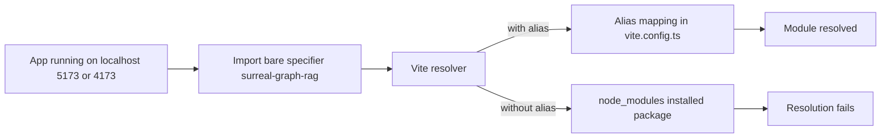

# Self-import support plan for surreal-graph-rag

Purpose: Verify that this project can import itself like a real consumer, document issues found with Playwright, and outline fixes.

Summary of Playwright verification

- Browser loaded app at http://localhost:5173/ and attempted dynamic module loading of bare specifiers: surreal-graph-rag, surreal-graph-rag/core, surreal-graph-rag/ui, surreal-graph-rag/types, surreal-graph-rag/node. All failed with 'Failed to resolve module specifier'.
- Dynamic module loading of local source modules via absolute /src paths succeeded (for example /src/lib/index.ts, /src/lib/ui/index.ts), confirming internal exports are valid when resolved through Vite.

Key findings and root causes

1. Bare specifiers are not resolvable in dev or preview

- There is no node_modules installation of this package in the showcase app, and [vite.config.ts](vite.config.ts:7) has no resolve.alias to map the package name to source. Result: browser cannot resolve 'surreal-graph-rag' or its subpaths.

2. Packaging output directory does not match package.json exports

- [package.json](package.json:31) exports point to './dist/...', and top-level fields [package.json](package.json:28-30) also target './dist'.
- The packaging script [package.json](package.json:17) runs svelte-package with defaults, which outputs to 'package' by default (not 'dist'). Unless configured, the published package would not match the declared paths.
- The files array [package.json](package.json:20-24) includes 'dist', which will also be empty or missing if svelte-package outputs to 'package'.

3. Placeholder alias in Svelte config

- [svelte.config.js](svelte.config.js:11-13) declares an '@/_' alias pointing to './path/to/lib/_' placeholder, which is misleading and should be removed or corrected.

4. Playwright runs preview on 4173; alias must apply there too

- [playwright.config.ts](playwright.config.ts:4-7) uses 'npm run build && npm run preview' on port 4173. Any alias for self-import must be present in the Vite config used by preview builds, or the bare specifiers will still fail.

Remediation plan

A) Dev and test alias approach (quickest to validate self-import in this app)

- Add resolve.alias entries in [vite.config.ts](vite.config.ts:7) to map:
  - 'surreal-graph-rag' -> './src/lib'
  - 'surreal-graph-rag/core' -> './src/lib/core'
  - 'surreal-graph-rag/ui' -> './src/lib/ui'
  - 'surreal-graph-rag/types' -> './src/lib/types'
  - 'surreal-graph-rag/node' -> './src/lib/node'
- Ensure these aliases are used by both dev and preview (same config).
- Remove or correct the placeholder alias in [svelte.config.js](svelte.config.js:11-13).
- Add a Playwright e2e case to verify dynamic module loading of all bare specifiers under the preview server.

B) Package build alignment (required for external consumers)

- Option 1: Keep 'dist' in [package.json](package.json:31-59,61-76,20-29) and change 'prepack' to run 'svelte-package' with an explicit output directory 'dist' in [package.json](package.json:17).
- Option 2: Change all 'exports', 'svelte', 'types', and 'files' entries in [package.json](package.json:28-35,31-59,20-29) to point to 'package' and let svelte-package defaults stand.
- After aligning, run the build pipeline and validate with publint as already configured in [package.json](package.json:17).
- For a full external test, 'npm pack' and install the tarball into a separate consumer app to confirm imports work without aliases.

C) E2E verification

- Add an e2e test that:
  - Loads the app
  - Dynamically loads the bare specifiers and asserts keys exist
  - Confirms that math utilities, UI components, types, and node placeholder exports are accessible without errors in the browser for applicable modules
- Keep a separate test for local '/src' imports as a baseline.

Acceptance criteria

- In dev and in preview: dynamic loading of 'surreal-graph-rag' and each subpath succeeds without resolution errors.
- The e2e test passes in CI.
- Packaging directories and package.json paths are consistent, and 'publint' reports no critical issues.

Resolution diagram

References to current configuration

- Exports and fields in [package.json](package.json:28-59)
- Packaging scripts in [package.json](package.json:15-19)
- Vite config entry point [vite.config.ts](vite.config.ts:1)
- Svelte config alias [svelte.config.js](svelte.config.js:11-13)
- Playwright webServer command and port [playwright.config.ts](playwright.config.ts:4-7)
