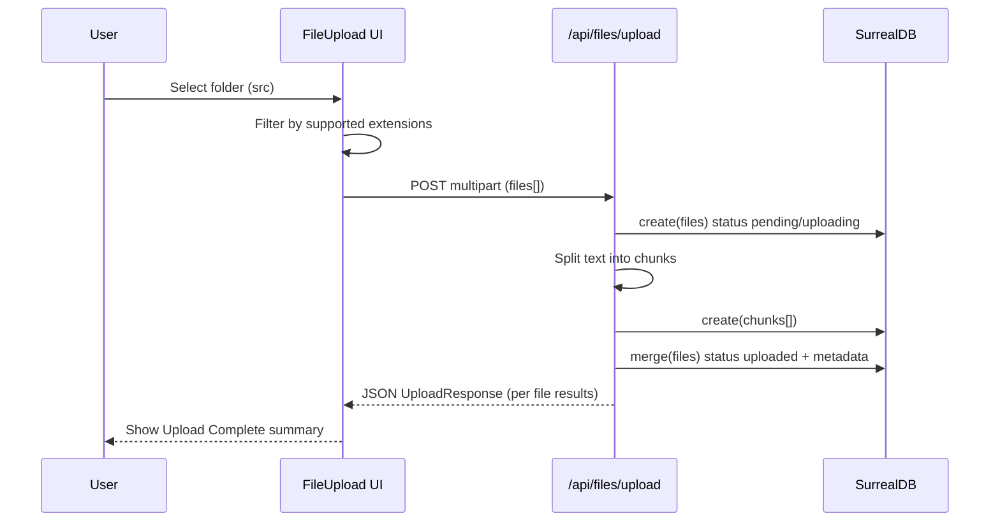
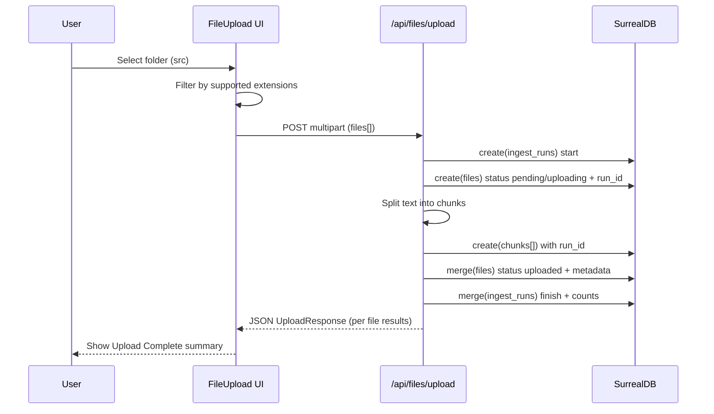

# Upload Verification Plan and Findings — Folder Import (src)

Purpose

- Validate the end-to-end upload flow using Playwright by importing the entire src directory
- Confirm backend chunking and DB writes
- Map issues and propose fixes for future iterations

What was tested (via Playwright)

- Navigated to the upload page [/file-upload](src/routes/file-upload/+page.svelte)
- Switched to folder mode and opened the folder chooser
- Selected the entire project src directory (113 files detected)
- Triggered upload and waited for completion UI

Evidence and results

- UI showed “Upload Complete”
- Summary: 113 successful, 0 failed, 304 total chunks
- The console logged “Upload completed: [...]” confirming the client handler’s receipt of results
- The upload flow endpoint is implemented in [src/routes/api/files/upload/+server.ts](src/routes/api/files/upload/+server.ts:1)
- Backend DB connection logic used by that route is in [src/lib/server/infra/db.ts](src/lib/server/infra/db.ts:1)

Current implementation notes

- Frontend components:
  - File upload orchestrator: [src/lib/ui/FileUpload.svelte](src/lib/ui/FileUpload.svelte:1)
  - File/folder selection UI: [src/lib/ui/FileSelector.svelte](src/lib/ui/FileSelector.svelte:1)
  - Upload utilities: [src/lib/ui/file-upload-utils.ts](src/lib/ui/file-upload-utils.ts:1)
  - Upload response types: [src/lib/ui/file-upload-types.ts](src/lib/ui/file-upload-types.ts:1)
- Backend API:
  - Upload processing route (LangChain split + SurrealDB writes): [src/routes/api/files/upload/+server.ts](src/routes/api/files/upload/+server.ts:1)
  - SurrealDB connection and lifecycle management: [src/lib/server/infra/db.ts](src/lib/server/infra/db.ts:1)

Issues found and recommended fixes

1. Types mismatch between server writes and shared UI types

- Details:
  - The server merges additional fields into the files table (original_text, original_length, original_sha256, etc.) [src/routes/api/files/upload/+server.ts](src/routes/api/files/upload/+server.ts:96) that are not present in the shared FileRecord type [src/lib/ui/file-upload-types.ts](src/lib/ui/file-upload-types.ts:1)
  - Workaround casting is present in the server route (Omit<FileRecord,...> as unknown), which weakens type safety
- Recommendation:
  - Create a server-side types module for DB records (e.g. FileRecordDb) that includes the extra fields
  - Alternatively, extend the shared FileRecord with optional fields and split client vs server types clearly
  - Align all db.create/db.merge payloads to the new types so casting is unnecessary

2. accept attribute is not evaluated (string literal)

- Details:
  - In FileSelector the accept attribute is currently a literal string, not an evaluated expression [src/lib/ui/FileSelector.svelte](src/lib/ui/FileSelector.svelte:162)
- Recommendation:
  - Change to an evaluated expression so the browser file chooser filters appropriately:
  - Proposed change (concept): accept={'.' + SUPPORTED_TEXT_EXTENSIONS.join(',.')}
  - Filtering is already enforced in code via isSupportedTextFile, but fixing accept improves UX

3. Authentication/sign-in to SurrealDB is commented

- Details:
  - DB signin is currently commented out [src/lib/server/infra/db.ts](src/lib/server/infra/db.ts:29)
  - The in-use engine (surrealkv) may not require credentials, but production setups likely will
- Recommendation:
  - Gate signin logic by env flags and enable signin when configured (DB_USERNAME/DB_PASSWORD available)
  - Add robust error messaging if connection requires auth and credentials are missing

4. Large-folder uploads are sent as a single multipart request

- Details:
  - Current approach appends all files to a single FormData and uploads via XHR [src/lib/ui/file-upload-utils.ts](src/lib/ui/file-upload-utils.ts:93)
  - Works for 100+ small files, but could hit body size limits in some environments
- Recommendation:
  - Introduce batching (configurable batch size) to split very large sets into multiple requests
  - Optionally add retry logic and a resumable mechanism for robustness

5. Missing server-side validation for extremely large files

- Details:
  - Client enforces a 10MB per-file limit [src/lib/ui/file-upload-utils.ts](src/lib/ui/file-upload-utils.ts:151), but server route does not explicitly enforce max size or type (beyond text splitting)
- Recommendation:
  - Add validation in the server route to fail early with explicit messages on oversized or unsupported files
  - Return structured errors per file so the UI can present granular results

6. Observability and audit trail

- Details:
  - Server logs status transitions and chunk counts [src/routes/api/files/upload/+server.ts](src/routes/api/files/upload/+server.ts:127), but no explicit audit record beyond the DB tables
- Recommendation:
  - Persist a small “ingest runs” log table keyed by batch/upload to correlate files/chunks with run metadata (time, counts, errors)
  - Wire a link from the UI to /debug/files to observe records after completion

Proposed follow-up tasks

- Types and contracts

  - Introduce Db-specific record types with the extra persisted fields and remove cast workarounds
  - Add zod or similar schema validation at the API boundary

- UX and input handling

  - Fix the accept attribute in FileSelector
  - Add user feedback for skipped files when filtering by type

- Scalability and resilience

  - Add batching for large directory uploads
  - Add retries with backoff on network errors
  - Consider streaming parsing for very large files

- Observability
  - Add an “ingest runs” table and link from the UI
  - Enhance /debug/files page to filter by run, date range, and file name

Mermaid: upload flow overview

Acceptance criteria

- Selecting src in folder mode displays selected file count and total size
- Upload completes without errors and shows the final summary
- Records and chunks exist in DB with accurate counts and status transitions
- Client and server types are aligned to prevent casts
- accept attribute filters file chooser as expected

API/version alignment notes (Context7)

- SvelteKit (v2, Svelte 5 runes)
  - Use RequestEvent.request.formData() in endpoint handlers. See [`POST` handler example](src/routes/api/files/upload/+server.ts:12)
  - Return JSON with `json()` from `@sveltejs/kit` as in [`json()` usage](src/routes/api/files/upload/+server.ts:174)
  - For forms with file inputs, the page form must set enctype="multipart/form-data" if using native forms or `use:enhance` (Context7: SvelteKit 2 migration). Our client uses XHR and FormData directly, so no change needed.
- SurrealDB JavaScript SDK
  - Current code constructs SDK via new Surreal({ engines: surrealdbNodeEngines() }) and connects with namespace/database in connect options [`getDb()`](src/lib/server/infra/db.ts:67) and [`connectDb()`](src/lib/server/infra/db.ts:22)
  - Context7 docs show both patterns are valid: either `connect(host, { namespace, database })` (what we use) or `connect(host)` then `use({ namespace, database })`. Keep current approach.
  - Authentication via `db.signin({ username, password })` is supported and recommended for non-embedded engines. We will gate this on env presence.

Implementation checklist for the implementer

1. Types alignment (remove casts)

- Action:
  - Keep DB-persisted fields in FileRecord with optional props already present [`file-upload-types.ts`](src/lib/ui/file-upload-types.ts:27-33)
  - Update server code to avoid cast-through-unknown on baseRecord creation by setting only fields in FileRecord and omitting commentary about cast
- Acceptance:
  - `src/routes/api/files/upload/+server.ts` compiles without `as unknown` casts on `baseRecord`
- Where:
  - [`+server.ts` baseRecord definition](src/routes/api/files/upload/+server.ts:65)

2. UI accept attribute fix

- Problem:
  - Literal string is used, not evaluated [`accept` attr](src/lib/ui/FileSelector.svelte:162)
- Change:
  - Replace accept=".{SUPPORTED_TEXT_EXTENSIONS.join(',.')}" with evaluated expression:
    - Svelte snippet: accept={'.' + SUPPORTED_TEXT_EXTENSIONS.join(',.')}
- Where:
  - [`FileSelector.svelte` input[type=file]](src/lib/ui/FileSelector.svelte:158-166)
- Result:
  - OS file chooser filters by supported extensions

3. Server-side validation parity with client

- Current client limits: 10MB per file [`validateFile`](src/lib/ui/file-upload-utils.ts:151)
- Add in endpoint before processing each file:
  - If file.size > 10MB: push structured error { success: false, fileName, errorMessage: 'File size exceeds 10MB limit' } and skip DB writes for that file
  - If unsupported type (mirror isSupportedTextFile on server by checking extension): same handling
- Where:
  - Loop over files in [`+server.ts`](src/routes/api/files/upload/+server.ts:54)
- Return:
  - Keep per-file results; maintain `successCount`/`errorCount` aggregate [`response`](src/routes/api/files/upload/+server.ts:166-174)

4. Batching strategy option (for very large folders)

- Current: single multipart request of all files [`uploadFiles`](src/lib/ui/file-upload-utils.ts:93)
- Plan:
  - Introduce optional batch size (e.g., 25-50 files per request) in client util and component
  - Client-side contract unchanged per request; UI aggregates results across batches
- Implementation notes:
  - Add optional parameter to uploadFiles(files, onProgress, opts?: { batchSize?: number })
  - Route handler stays the same (idempotent per request)

5. SurrealDB auth gating and error messaging

- Add conditional signin in DB bootstrap:
  - If SERVER_CONFIG.db.username and SERVER_CONFIG.db.password exist, call `db.signin({ username, password, namespace, database })` after connect or use; log success/failure
  - Keep connection method with options as implemented [`connectDb`](src/lib/server/infra/db.ts:22-26)
- Where:
  - Insert gated signin after connect in [`connectDb`](src/lib/server/infra/db.ts:27-36)
- Messaging:
  - If engine requires auth but creds missing, throw with descriptive message and advise setting DB_USERNAME/DB_PASSWORD

6. Minimal ingest runs audit trail

- Schema (conceptual):
  - Table: ingest_runs { id, started_at, finished_at, file_count, chunk_count, error_count }
  - Add run_id to files and chunks records for correlation
- Implementation steps:
  - On POST start: create ingest_runs record; hold run_id in scope
  - When creating files/chunks: include run_id
  - On completion: merge finished_at, counts
- Where to wire:
  - Create run at start of request in [`+server.ts`](src/routes/api/files/upload/+server.ts:30)
  - Include run_id in [`fileRecord`](src/routes/api/files/upload/+server.ts:65-75) and [`chunkRecords`](src/routes/api/files/upload/+server.ts:106-115)

7. Observability wiring

- After successful upload, add UI link to /debug/files, optionally filtered by latest run_id
- Enhance /debug/files page to accept query params run_id and date range

8. SvelteKit endpoint compliance notes (Context7)

- Use `request.formData()` for multipart; already implemented [`+server.ts`](src/routes/api/files/upload/+server.ts:14-16)
- Use `json()` from `@sveltejs/kit` to return structured responses; already implemented [`return json(response)`](src/routes/api/files/upload/+server.ts:174)
- For size-limit failures, return 400 per-file within the batch response rather than failing the whole request. If total body too large, server/framework may return 413.

Mermaid: upload flow overview

References

- Upload page: [src/routes/file-upload/+page.svelte](src/routes/file-upload/+page.svelte)
- Upload UI: [src/lib/ui/FileUpload.svelte](src/lib/ui/FileUpload.svelte:1)
- Selector UI: [src/lib/ui/FileSelector.svelte](src/lib/ui/FileSelector.svelte:158)
- Upload utils: [src/lib/ui/file-upload-utils.ts](src/lib/ui/file-upload-utils.ts:93)
- Types: [src/lib/ui/file-upload-types.ts](src/lib/ui/file-upload-types.ts:1)
- API route: [src/routes/api/files/upload/+server.ts](src/routes/api/files/upload/+server.ts:1)
- DB infra: [src/lib/server/infra/db.ts](src/lib/server/infra/db.ts:12)
- Env defaults: [.env](.env), [.env.example](.env.example)

Implementer checklist — precise edits mapped to files

Follow these steps exactly. Each bullet includes the precise target and where to apply the change.

1. Server-side validation parity with client

- Goal: Enforce 10MB limit and allowed extensions on server, mirroring client validation
- Where to add:
  - Before DB writes inside the for-of loop in [src/routes/api/files/upload/+server.ts](src/routes/api/files/upload/+server.ts:54)
- What to do:
  - If file.size > 10MB, push a structured error result and continue
  - If extension not in SUPPORTED_TEXT_EXTENSIONS, push a structured error result and continue
- Hints:
  - Use filename extension parsing consistent with client utility [getFileExtension()](src/lib/ui/file-upload-utils.ts:74)
- Acceptance:
  - Oversized/unsupported files are rejected per-file; response aggregates success/error counts

2. Remove cast workaround on baseRecord

- Goal: Eliminate cast-through-unknown and adhere to FileRecord optional original\_\* fields
- Where:
  - baseRecord creation in [src/routes/api/files/upload/+server.ts](src/routes/api/files/upload/+server.ts:65)
- What to do:
  - Construct baseRecord without casting via unknown; only assign fields present in [FileRecord](src/lib/ui/file-upload-types.ts:8) with original\_\* omitted at creation and merged later
- Acceptance:
  - +server.ts compiles without as unknown cast at baseRecord declaration

3. UI accept attribute fix

- Goal: Ensure OS file chooser filters by supported extensions
- Where:
  - File input accept attribute in [src/lib/ui/FileSelector.svelte](src/lib/ui/FileSelector.svelte:158)
- What to change:
  - Replace the literal string with an evaluated expression:
    - accept={'.' + SUPPORTED_TEXT_EXTENSIONS.join(',.')}
- Acceptance:
  - The accept attribute is evaluated; only allowed types are selectable

4. Optional batching for large folders

- Goal: Split very large selections into smaller multipart requests
- Where:
  - Function signature and logic of [uploadFiles()](src/lib/ui/file-upload-utils.ts:93)
- What to do:
  - Extend signature to uploadFiles(files, onProgress, opts?: { batchSize?: number })
  - Default batchSize undefined (no batching). When set, slice files array and send multiple sequential requests, aggregating results; preserve progress reporting per batch
- Acceptance:
  - Large selections can be uploaded in batches without breaking server contract

5. SurrealDB auth gating and messaging

- Goal: Enable signin when credentials provided; improve errors for missing creds in required environments
- Where:
  - After connect in [connectDb()](src/lib/server/infra/db.ts:22)
- What to do:
  - If SERVER_CONFIG.db.username and SERVER_CONFIG.db.password exist, call db.signin({ username, password }) after connect/use; log success/failure
  - If engine requires auth and creds missing, surface a clear error instructing to set DB_USERNAME/DB_PASSWORD in .env
- References:
  - Context7 SurrealDB SDK usage shows db.signin is supported; we already connect with namespace/database in connect options [getDb()](src/lib/server/infra/db.ts:67)
- Acceptance:
  - When creds present, signin succeeds; when required and absent, a descriptive error is thrown

6. Minimal ingest runs audit trail

- Goal: Persist per-upload audit for observability
- Schema (conceptual):
  - ingest_runs { id, started_at, finished_at, file_count, chunk_count, error_count }
  - Add run_id to files and chunks
- Where to wire:
  - Create a run at start of POST just after connecting DB in [src/routes/api/files/upload/+server.ts](src/routes/api/files/upload/+server.ts:49)
  - Include run_id on files baseRecord and chunk records: [file creation and merge](src/routes/api/files/upload/+server.ts:77), [chunk creation](src/routes/api/files/upload/+server.ts:106)
  - After loop, merge ingest_runs with finished_at and counts near [response creation](src/routes/api/files/upload/+server.ts:166)
- Acceptance:
  - A run record exists and correlates files/chunks via run_id

7. SvelteKit endpoint compliance (Context7 verification)

- Confirmed patterns:
  - Use RequestEvent.request.formData() in POST [example](src/routes/api/files/upload/+server.ts:12)
  - Return JSON with [json()](src/routes/api/files/upload/+server.ts:174)
  - If you later switch to native forms with use:enhance, ensure enctype="multipart/form-data" on the form (Context7 SvelteKit 2 migration note)

8. Test checklist

- npm run check should pass
- Upload of src (folder mode) succeeds and shows summary
- DB contains files and chunks with correct statuses and counts
- Oversized/unsupported files are rejected server-side with granular errors
- Accept attribute filters on file chooser
- If credentials present, DB signin occurs; if required but absent, meaningful error is shown
